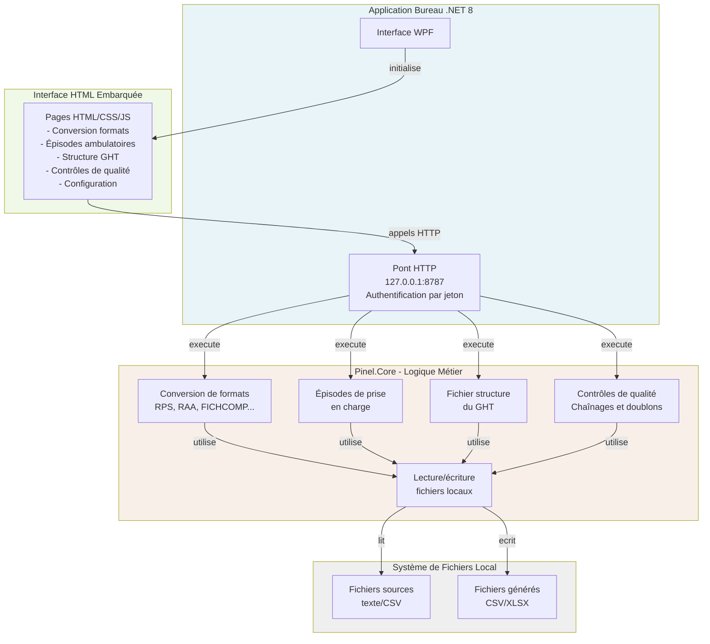

# Pinel

<!-- adam-badges:start -->
[](https://github.com/Adam-Blf/Projet-Pinel/commits)
[](https://hits.sh/github.com/Adam-Blf/Projet-Pinel/)
[](https://github.com/Adam-Blf/Projet-Pinel/commits)
[](https://github.com/Adam-Blf/Projet-Pinel)
[](LICENSE)
<!-- adam-badges:end -->


Outil de traitement des fichiers PMSI psychiatrie pour le Département d'Information Médicale du GHT Psy Sud Paris.

Pinel convertit les fichiers au format national ATIH (largeur fixe) en CSV exploitable, crée des épisodes de prise en charge ambulatoire, organise la structure du GHT et applique les contrôles de qualité du PMSI selon le cahier des charges du 22 décembre 2025.

**Pour qui** : techniciens d'information médicale, médecins du DIM, et équipes DSI évaluant la solution.

---

## Architecture



**Points clés** : L'application fonctionne en standalone sur le poste local. Aucune donnée ne sort de la machine. L'interface Web embarquée et servie sur la boucle locale (127.0.0.1) via un serveur HTTP intégré au processus WPF. Tous les fichiers lus et écrits se limitent aux dossiers que l'utilisateur autorise.

---

## Dossiers

| Chemin | Responsabilité |
|--------|---|
| `src/Pinel.Core` | Logique métier : formats ATIH, épisodes ambulatoires, contrôles de qualité, entrées/sorties fichiers |
| `src/Pinel.Desktop` | Interface WPF, serveur HTTP local, authentification, pont WebView2 vers Pinel.Core |
| `src/Pinel.Cli` | Outils en ligne de commande : import des formats ATIH, pseudonymisation, contrôles, apprentissage des corrections |
| `src/Pinel.Ml` | Modèle local de détection des lignes RAA supprimées par le DIM (ML.NET, LightGBM) |
| `reference/formats/2026` | Descriptifs Pinel tirés des classeurs officiels ATIH 2026 (PSY et MCO) |
| `web/` | Pages HTML, CSS, JavaScript de l'interface utilisateur |
| `tests/Pinel.Tests` | Tous les tests xUnit couvrant Pinel.Core |
| `docs/` | Quatre documents destinés à différents lecteurs |

---

## Compilation et lancement

**Prérequis** : .NET 8 SDK, disponible sur https://dotnet.microsoft.com/download.

**Compiler en Debug** :
```bash
dotnet build Pinel.sln
```

**Lancer l'application** (après compilation) :
```bash
dotnet run --project src/Pinel.Desktop/Pinel.Desktop.csproj
```

**Lancer les tests** :
```bash
dotnet test Pinel.sln
```

**Construire un exécutable autonome** (Release, fichier unique distribué) :
```bash
dotnet publish src/Pinel.Desktop/Pinel.Desktop.csproj -c Release
```

L'exécutable se trouve ensuite dans `src/Pinel.Desktop/bin/Release/net8.0-windows/win-x64/publish/Pinel.exe`. Aucune installation requise, aucun droit administrateur.

---

## Outils en ligne de commande

`dotnet run --project src/Pinel.Cli --` suivi de la commande. Aucune commande n'affiche de valeur de champ : seuls des chemins, des formats et des décomptes sortent sur la console.

| Commande | Rôle |
|---|---|
| `formats-importer <classeur.xlsx> <année> <domaine> <sortie>` | Convertit un classeur officiel de formats ATIH en descriptifs Pinel, un par feuille |
| `anonymiser <source> <cible> <descriptifs>` | Copie pseudonymisée d'un lot PMSI, sous clé DPAPI propre au poste. Refuse une cible synchronisée vers un nuage |
| `controler <dossier>` | Passe les contrôles qualité et compte les anomalies par code |
| `apprendre <dossier> <regles.json> <descriptifs>` | Tire les corrections régulières du DIM des paires origine / corrigé (`_CORR_main`, `_corrige_main`, ` - Corriger`) |
| `regles <regles.json>` | Liste les règles apprises, leur confiance et leur statut |
| `regle <regles.json> <n> valider, rejeter ou proposer` | Décision du DIM sur une règle |
| `suggerer <dossier> <regles.json> <descriptifs> [copies]` | Compte les lignes d'un lot concernées par les règles ; les copies n'appliquent que les règles validées |
| `entrainer <dossier> <modele> <descriptifs>` | Entraîne le modèle des suppressions RAA ; ne remplace le modèle en place que s'il fait mieux sur le même mois de contrôle |
| `scorer <dossier> <modele> <descriptifs> [rapport.csv]` | Signale les lignes RAA que le DIM supprimerait probablement ; le rapport ne porte que des numéros de ligne et des probabilités |
| `maj` | État de la mise à jour, sans ouvrir la fenêtre |
| `roles <descriptifs>` | Liste les champs que la pseudonymisation transforme |

Toutes ces commandes sont servies par le même `Pinel.exe` : sans argument il ouvre la fenêtre, avec un verbe il joue l'outil dans la console appelante.

**Données de santé.** Les lots réels ne sont lus qu'en local, dans un dossier de travail hors de tout dossier synchronisé : `Documents` peut remonter en entier vers un nuage grand public, non certifié HDS. `anonymiser` refuse une telle cible.

---

## Installation et mises à jour

`python tools/packager.py` produit `dist/Pinel-win-Setup.exe`, à distribuer une fois par poste. L'installation se fait sous le profil de l'utilisateur, sans droits d'administration.

Les versions suivantes n'ont pas besoin de repasser sur les postes : `python tools/packager.py --publier "\\serveur\partage\pinel"` dépose la mise à jour sur un dossier du réseau, et chaque poste la prend depuis l'écran « À propos ». Seule la différence avec la version installée est téléchargée, de l'ordre de quelques dizaines de kilooctets. Aucun accès internet n'est nécessaire, et un poste isolé continue de fonctionner avec la version qu'il a déjà.

Les données de travail vivent dans `%LOCALAPPDATA%\Pinel-DIM`, séparées du dossier d'installation : une désinstallation ne les emporte pas.

---

## Licence d'utilisation

Pinel s'utilise sous licence, rattachée au FINESS d'inscription e-PMSI de l'établissement. La licence est un fichier signé, vérifié localement : aucun appel sortant, rien à activer en ligne. Elle s'importe depuis l'écran « À propos ».

Sans licence valable, Pinel lit les fichiers et passe ses contrôles, mais n'écrit plus : pas d'export, pas de classeur nettoyé, pas de copie corrigée. Trente jours de tolérance suivent l'échéance, pour ne pas bloquer un département d'information médicale en pleine période de transmission.

---

## Documentation

Quatre documents complémentaires, à lire selon votre rôle :

| Document | Lecteur | Contenu |
|----------|--------|---------|
| `docs/01_GUIDE_UTILISATEUR.md` | Technicien TIM, Médecin DIM | Prise en main, écrans, données, premiers pas |
| `docs/02_DOSSIER_FONCTIONNEL_DIM.md` | Département d'Information Médicale | Spécifications du cahier des charges, règles de gestion, formats reconnus |
| `docs/03_DOSSIER_TECHNIQUE_DSI.md` | Direction des Ressources Numériques | Architecture, dépendances, déploiement, maintenance |
| `docs/04_SECURITE_ET_CONFORMITE.md` | DSI, Responsable conformité | Authentification, RGPD, anonymisation, contrôles de sécurité |
| `docs/05_SYSTEME_DE_DESIGN.md` | Qui touche à l'interface | Jetons, primitives, états, accessibilité. La page vivante est `web/systeme.html` |

---

## Limites connues

Cette section est volontairement franche. Les points ci-dessous sont établis, et ils doivent être corrigés ou validés par le DIM avant toute mise en production.

**Le format est reconnu sur le nom du fichier, pas sur la ligne** : `AtihFormatIdentifier` déduit le format du seul nom du fichier, puis `AtihParser` applique le même découpage à toutes ses lignes. C'est un défaut de conception. Un fichier PMSI peut mélanger plusieurs types d'enregistrement, chacun avec sa propre structure, et le type est porté par la ligne elle-même. Conséquence directe pour l'utilisateur : un fichier dont le nom ne contient pas le sigle du format est ignoré, et un fichier mal nommé est découpé avec le mauvais gabarit sans aucun message.

**Les positions des champs embarquées sont à reprendre** : `AtihMatrix` fige les positions de 23 formats, et son propre commentaire indique qu'elles ont été reprises d'un script Python antérieur, non des descriptifs officiels de l'ATIH. Sur 23 entrées, 12 déclarent des positions identiques. Cas le plus net : les formats anonymes RPSA et R3A se voient attribuer une position d'identifiant patient et de date de naissance, alors que l'arrêté du 23 décembre 2016 modifié, article 5, établit que ces fichiers n'en contiennent pas, le numéro d'identification permanent y étant remplacé par une anonymisation irréversible. Les descriptifs officiels de l'ATIH font foi et doivent être déposés format par format.

**Deux formats déclarés n'ont pas de réalité vérifiée** : FICHSUP est un recueil agrégé, sans ligne patient, et il a été supprimé en psychiatrie au 1er janvier 2021 au profit de FICHCOMP. EDGAR n'est pas un format de fichier mais une typologie d'actes (entretien, démarche, groupe, accompagnement, réunion) codée à l'intérieur du RAA.

**La clé de chaînage retenue est discutable** : les contrôles de couverture joignent l'activité et le VID-HOSP sur l'identifiant permanent du patient. La clé de chaînage nationale repose sur le numéro administratif de séjour et sur une anonymisation du numéro de sécurité sociale, jamais sur l'identifiant interne de l'établissement. À trancher avec le DIM avant de se fier aux anomalies produites.

**Corrections volontaires sur FICHCOMP transports** : la ligne FICHCOMP produite pour les transports corrige trois défauts du classeur Excel d'origine, qui sont documentés et assumés. Premièrement, chaque formule de la colonne M visait une ligne située 196 rangs plus bas, donc composait la ligne d'un autre patient. Deuxièmement, la date était lue dans une colonne étiquetée identifiant patient et restée vide, au lieu de la date de transport. Troisièmement, le libellé d'unité fonctionnelle, de longueur variable, était concaténé sans être complété, ce qui décalait tout ce qui suivait. Les lignes produites ne seront donc pas identiques à celles du classeur actuel. Deux largeurs de champ ne sont attestées par aucune formule d'origine et restent à valider par le DIM.

**Aucun contrôle ne bloque une transmission sur le contenu** : le niveau bloquant n'est atteint qu'en cas d'erreur d'ouverture de fichier. Le garde-fou annoncé au chapitre 8 du guide utilisateur ne peut donc pas passer au rouge sur une donnée fausse.

**Intelligence artificielle sur l'exhaustivité du recueil** : le cahier des charges citait des pistes pour signaler les lacunes en ambulatoire. Cette phase n'est pas traitée dans cette version.

---

## Retours et améliorations

Tous les retours sur l'interface, les noms, les critères de validation et les limites peuvent être transmis au DIM. Les noms d'écrans et les libellés de colonnes sont particulièrement malléables et seront adaptés si demandé.
