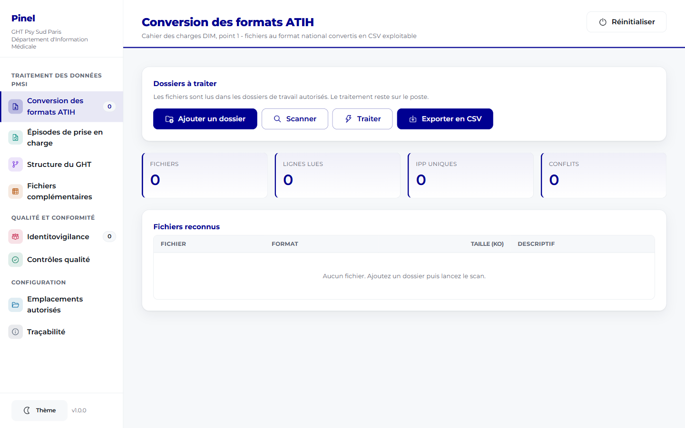
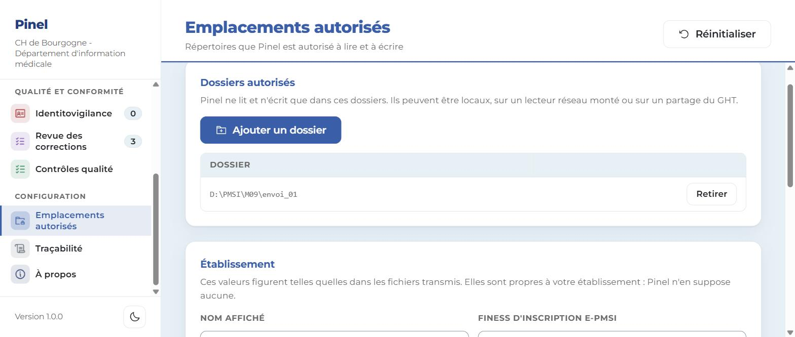
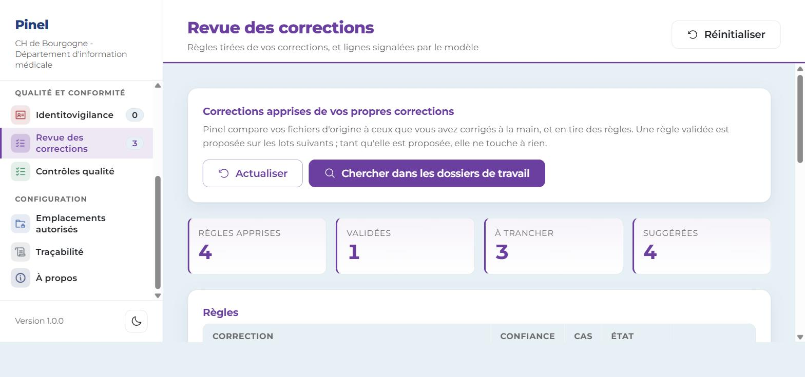
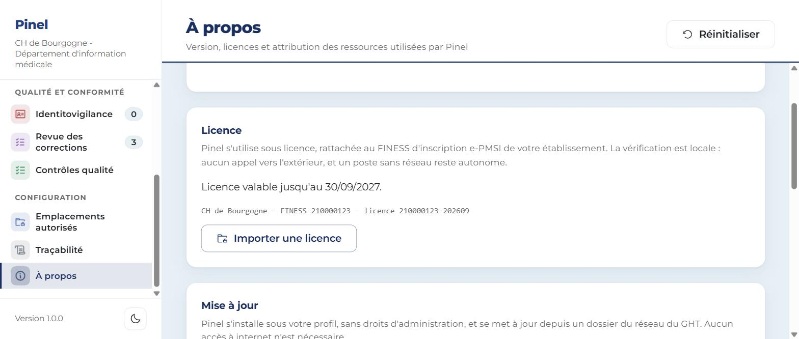

# Guide utilisateur

Version 1.0.0.

Ce guide s'adresse aux personnes qui vont se servir de Pinel : techniciens
d'information médicale, médecins du DIM. Il ne suppose aucune compétence
informatique particulière.

Si un mot vous arrête, il est expliqué dans le [glossaire](06_GLOSSAIRE.md). Si
vous n'avez jamais entendu parler de Pinel, commencez par
[Commencer ici](00_COMMENCER_ICI.md).

---

## 1. Le problème que résout Pinel

Les fichiers que votre établissement transmet à l'État sont des fichiers texte
sans séparateur. Tout y est collé : le numéro de l'établissement, celui du
patient, sa date de naissance, les codes. On sait où commence chaque information
parce que sa position est fixée d'avance et publiée chaque année.

Ouvert dans Excel, un tel fichier donne une colonne unique de 154 caractères pour
un RPS, illisible. Pinel le découpe et le rend exploitable.

Il fait ensuite trois choses de plus : il contrôle vos fichiers avant
transmission, il reconstruit des parcours à partir d'actes isolés, et il apprend
de vos corrections pour vous proposer de les systématiser.

### Ce qu'il ne fait pas

Pinel ne se connecte à **aucun** logiciel. Il ne remplace ni votre dossier
patient, ni votre gestion administrative, ni vos outils de pilotage. Il ne
transmet rien aux tutelles : le dépôt reste votre geste.

Il ne sort jamais de votre poste. Aucun serveur, aucun nuage, aucun compte en
ligne, aucun flux sortant.

### Une note sur les noms

Les intitulés des écrans, les noms des fichiers produits et les libellés des
colonnes ne sont pas gravés. Ils ont été choisis pour être compris d'un
technicien d'information médicale, mais ce sont des propositions. Demandez-en le
changement, il sera repris partout.

---

## 2. Installer et démarrer

### 2.1 L'installation

Lancez le fichier d'installation. Il s'installe **dans votre profil
utilisateur**, sans droit d'administration et sans intervention de votre
direction informatique.

Ensuite, les mises à jour arrivent depuis un dossier du réseau de votre
établissement, jamais depuis internet. Vous verrez dans l'écran **À propos**
qu'une version est disponible, et l'installation ne télécharge que la différence,
quelques dizaines de kilo-octets au lieu de cent méga-octets.

Un poste sans accès à ce dossier continue de fonctionner avec la version qu'il a.
Rien ne se bloque.

### 2.2 Le prérequis

Le poste doit disposer du composant Windows nommé WebView2, présent d'origine sur
Windows 11 et sur Windows 10 à jour. S'il manque, Pinel s'ouvre sur une fenêtre
blanche. Ce n'est pas réparable de votre côté : signalez-le à votre direction
informatique.

### 2.3 La première ouverture



La colonne de gauche donne les dix écrans, rangés en trois groupes :

| Groupe | Écrans |
|---|---|
| **Traitement des données PMSI** | Conversion des formats ATIH, Épisodes de prise en charge, Structure du GHT, Transports et fichiers complémentaires |
| **Qualité et conformité** | Identitovigilance, Revue des corrections, Contrôles qualité |
| **Configuration** | Emplacements autorisés, Traçabilité, À propos |

Vous pouvez circuler d'un écran à l'autre avec les flèches du clavier.

En haut de chaque écran, un bouton **Réinitialiser** vide la session. Prenez-en
l'habitude entre deux lots, surtout sur un poste partagé : les données lues ne
vivent qu'en mémoire et disparaissent à cet instant.

---

## 3. Les trois réglages à faire une fois

Ouvrez **Emplacements autorisés**.



### 3.1 Votre établissement

Saisissez le numéro FINESS d'inscription e-PMSI de votre établissement. Pinel ne
suppose aucun hôpital en particulier : c'est vous qui le lui dites. Ce numéro sert
aux contrôles et à la licence.

### 3.2 Vos dossiers de travail

**Pinel refuse de lire ou d'écrire où que ce soit tant que vous ne l'avez pas
autorisé.** Cliquez sur **Ajouter un dossier** pour chaque emplacement que vous
utilisez : un dossier local, un lecteur réseau monté comme `O:\RIMP`, un partage
du groupement.

Cette contrainte est volontaire. Elle n'est pas là pour vous ralentir mais pour
qu'une fausse manipulation ne puisse pas faire sortir un fichier de données de
santé du périmètre prévu. Un dossier non déclaré donne un refus explicite, jamais
un silence.

La liste peut contenir des dossiers que vous n'avez pas ajoutés : votre direction
informatique peut en imposer par stratégie de groupe.

### 3.3 Où vont les résultats

Deux réglages complètent l'écran :

- le **dossier de sortie**, où Pinel écrit les fichiers qu'il produit ;
- le **dossier des descriptifs de format**, expliqué au chapitre 4.3.

---

## 4. Convertir un lot de fichiers

C'est l'usage principal.

### 4.1 Les quatre gestes

1. Ouvrez **Conversion des formats ATIH** et cliquez sur **Ajouter un dossier**.
2. Cliquez sur **Scanner**. Pinel parcourt le dossier et ses sous-dossiers et
   affiche le format reconnu pour chaque fichier.
3. Cliquez sur **Traiter**. La lecture démarre, plusieurs fichiers à la fois.
4. Cliquez sur **Exporter en CSV**. Un fichier par fichier d'origine est écrit
   dans le dossier de sortie.

### 4.2 Ce que vous obtenez

Une ligne par ligne d'origine, une colonne par information, plus trois colonnes
qui disent d'où vient chaque ligne : le fichier source, le numéro de ligne et le
format reconnu.

Le fichier s'ouvre directement dans Excel, sans assistant d'importation et sans
accents cassés.

### 4.3 Les descriptifs de format, à déposer une fois par an

C'est le seul point de ce guide qui demande un peu d'attention. Prenez cinq
minutes, vous n'y reviendrez plus.

#### Pourquoi

Un fichier à largeur fixe n'a de sens qu'accompagné du document qui dit quelle
information occupe quelle position. Ce document change tous les ans, et l'ATIH le
publie.

Pinel embarque des positions minimales pour les formats qui portent un
identifiant patient, ce qui suffit à démarrer. Mais dès que vous voulez toutes vos
colonnes, ou dès qu'un format change, vous déposez le descriptif de l'année.

#### Ne confondez pas trois fichiers

C'est là que naît la confusion, alors posons-les côte à côte.

| Le fichier | Qui le fournit | À quoi il sert |
|---|---|---|
| **Le fichier PMSI** | Votre chaîne de production | Ce sont vos données, à largeur fixe |
| **Le descriptif de format** | Vous, recopié de l'ATIH | Il dit où commence chaque information |
| **Le CSV produit** | Pinel | C'est le résultat, lisible dans Excel |

#### Comment écrire un descriptif

Créez un fichier texte nommé d'après le format, par exemple `RPS.format.csv`, et
placez-le dans le dossier des descriptifs. Son contenu :

```
# format: RPS
# annee: 2026
nom;debut;longueur;libelle
FINESS;1;9;FINESS de l'etablissement
IPP;22;20;Identifiant permanent du patient
DATE_ACTE;42;8;Date de l'acte au format JJMMAAAA
```

Une ligne par information, quatre valeurs séparées par un point-virgule : le nom
de la colonne, la position de son premier caractère, le nombre de caractères, et
un libellé que votre équipe comprend. Le premier caractère de la ligne porte le
numéro 1.

> **Les chiffres ci-dessus sont un exemple de forme, pas des valeurs de
> référence.** Ne les recopiez pas. Les positions réelles se relèvent dans le
> document publié par l'ATIH pour le format et l'année que vous traitez. Une
> position fausse décale toute la ligne et produit un fichier qui a l'air correct.

Ajouter une nouvelle année revient à déposer un nouveau fichier. Aucune mise à
jour de Pinel n'est nécessaire.

#### Le raccourci

Si vous disposez du classeur officiel des formats publié par l'ATIH, vous n'avez
rien à recopier à la main : la commande `pinel formats-importer` convertit le
classeur en descriptifs d'un coup. Demandez à votre correspondant informatique,
c'est décrit dans le dossier technique.

#### Si aucun descriptif n'est déposé

Pour un format qui porte un identifiant patient, Pinel utilise ses positions
minimales et sort deux colonnes.

Pour un format anonyme, il **ne sort rien du contenu de la ligne** et vous le
signale. C'est volontaire : les formats anonymes ne contiennent, par
construction, ni identifiant ni date de naissance, et inventer un découpage
ferait passer pour une donnée patient ce qui n'en est pas une. Mieux vaut une
colonne brute signalée qu'un découpage faux et silencieux.

### 4.4 Les formats reconnus

Vingt-sept formats, dont sept portent un identifiant patient en clair.

| Domaine | Formats |
|---|---|
| Psychiatrie | RPS, RAA, RPSA, R3A, VID-IPP, HOSP-FACT, FICHCOMP-ISO, FICHCOMP-TP, FICHSUP-PSY, FICUM-PSY, RSF-ACE-PSY |
| Transversal | VID-HOSP, ANO-HOSP, HOSP-PMSI, FICHCOMP |
| SSR et SMR | RHS, SSRHA, RAPSS, FICHCOMP-SMR |
| HAD | RPSS, RAPSS-HAD, FICHCOMP-HAD, SSRHA-HAD |
| MCO | RSS, RSFA, RSFB, RSFC |

Deux formats acceptent aussi leurs longueurs de transition : le RPS en 142 et 148
caractères, le RAA en 86 et 90.

EDGAR n'est pas dans cette liste, et ce n'est pas un oubli : c'est une typologie
d'actes codée à l'intérieur du RAA, pas un format de fichier.

---

## 5. Reconstruire des parcours

Dans le format national, un acte ambulatoire n'est rattaché ni à un séjour ni à
un dossier : c'est une ligne isolée. Impossible de raisonner en parcours.

L'écran **Épisodes de prise en charge** reconstruit cette maille manquante.

### 5.1 La règle

Un épisode regroupe les journées consécutives d'un même patient, dans la même
unité médicale et sur le même site. Il se ferme dès qu'une journée est sautée, et
dans tous les cas au 31 décembre puisque le recueil est annuel.

Quatre réglages permettent d'ajuster, et la règle appliquée est écrite dans le
fichier produit :

- la tolérance en jours sans venue, zéro par défaut ;
- la rupture au changement d'unité médicale ;
- la rupture au changement de site ;
- la fermeture au 31 décembre.

> **Regardez la tolérance avant votre premier calcul.** À zéro, un suivi
> hebdomadaire en centre médico-psychologique produit un épisode par
> consultation, tous de durée nulle, ce qui ne décrit aucun parcours. La bonne
> valeur dépend de votre organisation : c'est une décision de service, pas un
> réglage technique.

### 5.2 Le résultat

Chaque épisode reçoit un identifiant stable, construit sur le patient, le site,
l'unité et la date de début. Deux calculs sur le même lot donnent les mêmes
identifiants, ce qui permet de comparer deux exports.

Le fichier produit contient les dates de début et de fin, le nombre de venues et
la durée de présence. La durée vaut 0 pour une venue isolée, 1 pour deux journées
consécutives. Au-delà, en secteur d'urgence, le compteur **Durée supérieure à 1
jour** signale ce qui mérite un regard : un problème d'aval ou d'organisation dans
le parcours.

### 5.3 Ce qu'il faut avoir

Le calcul demande un descriptif déclarant au minimum un identifiant patient et
une date. S'il manque, Pinel liste les fichiers écartés plutôt que de produire
des épisodes faux.

---

## 6. Structure du groupement

Ouvrez **Structure du GHT** et désignez votre fichier, en CSV ou en TSV. Pinel
reconnaît les colonnes même si leurs intitulés varient, reconstruit l'arbre des
rattachements et repère les codes de secteur avec leur type : G pour adulte, I
pour infanto-juvénile, D pour unité pour malades difficiles, P pour unité
hospitalière spécialement aménagée, Z pour intersectoriel.

La représentation graphique de cet arbre n'est pas encore produite
automatiquement.

---

## 7. Transports et fichiers complémentaires

### 7.1 Nettoyer un classeur de transports

Les exports de la chaîne de facturation répètent le bloc d'en-tête toutes les
quelques lignes et laissent la date de commande vide. Pinel produit une copie
nettoyée : blocs répétés retirés, date propagée sur les lignes vides, et une
seconde feuille qui conserve l'original avec les lignes retirées en rouge.

**Votre fichier d'origine n'est jamais modifié.**

### 7.2 Contrôler un fichier complémentaire

Longueur de ligne, numéro d'établissement, code, quantité et date sont vérifiés.
Les anomalies sont listées avec leur numéro de ligne.

---

## 8. Contrôler avant de transmettre

### 8.1 Identitovigilance

Quand un même identifiant patient porte deux dates de naissance selon les
fichiers, le chaînage casse et le patient est compté deux fois.

L'écran liste les conflits avec les dates observées, leur nombre d'occurrences et
les fichiers d'origine. La date la plus fréquente est proposée, vous pouvez en
choisir une autre.

> Un arbitrage automatique reste une hypothèse. Sur un patient suivi de longue
> date, vérifiez dans le dossier patient avant de trancher.

Vos arbitrages vivent en mémoire de la session. Ils ne sont écrits sur disque
qu'au moment où vous exportez. Une réinitialisation ou une fermeture les perd.

### 8.2 Contrôles qualité

Sept contrôles. Six regardent un fichier à la fois :

| Ce qui est vérifié | Ce qui est détecté |
|---|---|
| Numéro d'établissement | Un FINESS qui n'est pas neuf chiffres à sa position |
| Date de naissance | Date non numérique, année aberrante, jour ou mois inexistant, et date écrite à l'envers en AAAAMMJJ au lieu du JJMMAAAA attendu |
| Fichiers anonymes | Un identifiant en clair resté dans un fichier qui ne devrait en porter aucun |
| NIR de chaînage | NIR absent, mal formé, ou dont la clé de contrôle ne tombe pas juste |
| Lignes en double | Lignes strictement identiques, et volume anormal de doublons |
| Cohérence de l'année | Année future dans le nom du fichier, dates de naissance postérieures à l'année déclarée |

Le septième croise les fichiers entre eux : il vérifie que chaque patient présent
dans l'activité est bien chaîné, et signale dans les deux sens, les patients sans
chaînage et les chaînages sans patient.

### 8.3 Lire une anomalie

Chaque anomalie porte un niveau de gravité :

| Niveau | Ce que ça veut dire |
|---|---|
| **Blocker** | Ne transmettez pas en l'état |
| **Error** | Il y a une faute à corriger |
| **Warning** | Il y a un doute à lever, pas forcément une faute |
| **Info** | Simple remarque |

**Aucun message d'anomalie ne reproduit une donnée de patient.** Les messages
donnent la position du champ et la nature de l'écart, jamais la valeur lue. Ce
n'est pas une promesse : une garde le vérifie mécaniquement à chaque construction.

---

## 9. La revue des corrections

C'est l'écran le plus récent, et le plus inhabituel. Prenez le temps de lire ce
chapitre avant de l'utiliser.



### 9.1 Ce qu'il fait

Chaque mois, votre service corrige à la main les mêmes choses. Pinel compare vos
fichiers avant et après correction et en déduit ce que vous corrigez
systématiquement, sous la forme : *dans tel format, tel champ passe de telle
valeur à telle autre, éventuellement à telle condition*.

Chaque règle trouvée porte deux chiffres : le nombre de cas observés et un
pourcentage de confiance. Une règle à 100 % sur 959 cas veut dire que vous avez
fait la même correction 959 fois sans jamais faire autrement. Une règle à 70 % veut
dire qu'il y a des exceptions, donc qu'il faut regarder de près.

Vous validez, vous rejetez, ou vous laissez en attente.

### 9.2 Ce qui n'arrivera jamais

**Aucune règle ne modifie un fichier transmis à l'ATIH.** Ni automatiquement, ni
après validation, ni depuis cet écran.

Valider une règle veut dire une seule chose : elle entrera dans le décompte des
suggestions, pour que vous voyiez combien de lignes elle toucherait. Écrire une
copie corrigée demande une commande explicite, avec un dossier de destination
explicite, et produit une **copie**, jamais une modification de l'original.

### 9.3 Les lignes signalées

Le même écran affiche les lignes que le modèle statistique juge susceptibles
d'être supprimées, d'après ce qu'il a observé des mois précédents.

C'est une **suggestion de relecture**. Le modèle ne supprime rien, ne modifie
rien, et ne regarde ni identifiant ni date : seulement des codes et des
décomptes.

Si aucun modèle n'a été entraîné sur votre poste, l'écran vous le dit et cette
partie reste vide. C'est normal.

### 9.4 Ce qui reste à vous

Trois choses ne se généralisent pas et resteront manuelles :

- les corrections que vous appliquez au cas par cas, que Pinel liste à part
  plutôt que de les transformer en règle ;
- les valeurs absentes qu'il faut aller chercher ailleurs ;
- tout ce qui demande de regarder le dossier du patient.

---

## 10. Licence et mises à jour



### 10.1 La licence

Pinel se vérifie **hors ligne**, contre le numéro FINESS de votre établissement.
Aucun appel réseau, aucun compte : un poste isolé n'est jamais bloqué par un
service injoignable.

Ce qui se passe sans licence valide : **seules les écritures de fichiers
s'arrêtent.** Les exports, les classeurs nettoyés et les copies corrigées. Tout le
reste continue de fonctionner, y compris les contrôles qualité et
l'identitovigilance.

C'est délibéré : un département d'information médicale ne doit jamais perdre la
vue sur ses propres données à cause d'une échéance commerciale.

Une tolérance de **trente jours** suit l'échéance, de quoi couvrir une période de
transmission entière pendant qu'un bon de commande suit son chemin.

Pour installer une licence : écran **À propos**, bouton **Importer une licence**.
Un fichier dont la signature ne correspond pas est refusé et n'entre pas sur le
poste.

### 10.2 Les mises à jour

Dans le même écran, indiquez le dossier réseau où votre établissement dépose les
versions. Pinel vous dira s'il y a du nouveau. Vous choisissez le moment.

Tant qu'aucun dossier n'est indiqué, Pinel ne cherche rien et le dit. Il ne
tente jamais de sortir vers internet.

---

## 11. Bonnes pratiques

Les fichiers que vous manipulez contiennent des données de santé nominatives. Les
règles de votre service s'appliquent sans exception : pas de copie sur une clé
USB, pas d'envoi par messagerie personnelle, pas de dépôt sur un service en ligne.

Trois habitudes qui coûtent peu :

1. **Réinitialiser entre deux lots**, surtout sur un poste partagé.
2. **Passer par les contrôles avant chaque transmission**, même quand le lot
   ressemble au précédent.
3. **Regarder la traçabilité** de temps en temps. L'écran **Traçabilité** indique
   où se trouve le journal et affiche celui de la session. Il ne contient aucune
   donnée de patient.

Un mode sans fenêtre existe pour les traitements planifiés. Si vous croisez un
raccourci qui lance Pinel sans rien afficher, c'est de cela qu'il s'agit : c'est
décrit dans le dossier technique.

---

## 12. Quand ça ne marche pas

| Ce que vous voyez | Pourquoi | Quoi faire |
|---|---|---|
| Un fichier apparaît en INCONNU | Le format n'a pas pu être reconnu, ni par le nom ni par le contenu | Vérifiez que le sigle du format est dans le nom, par exemple `FV94_RPS_2026.txt` |
| Le dossier est refusé | Il n'est pas déclaré | Ajoutez-le dans Emplacements autorisés, chapitre 3.2 |
| Le CSV ne contient qu'une colonne | Aucun descriptif déposé pour ce format | Déposez le descriptif officiel, chapitre 4.3 |
| Aucun épisode calculé | Le descriptif ne déclare ni identifiant ni date | Complétez le descriptif du format concerné |
| Tous les épisodes durent zéro jour | La tolérance est à zéro | Ajustez-la, chapitre 5.1 |
| L'export est refusé, les contrôles marchent | Licence absente ou expirée depuis plus de trente jours | Chapitre 10.1 |
| La fenêtre reste blanche | WebView2 absent | Signalez-le à votre direction informatique, chapitre 2.2 |
| L'écran de revue est vide | Aucune règle apprise, aucun modèle entraîné sur ce poste | C'est normal tant que l'apprentissage n'a pas été lancé, chapitre 9 |

---

## 13. Ce qui n'existe pas encore

Ce guide décrit ce que Pinel fait. Voici ce qu'il ne fait pas encore, pour que
vous ne le cherchiez pas :

- la représentation graphique de la structure du groupement ;
- un export dédié vers les outils de pilotage ;
- la fiabilisation de l'exhaustivité du recueil ambulatoire à partir des signaux
  d'activité du dossier patient, qui suppose un accès en lecture au système
  d'information et donc une instruction préalable. Les épisodes du chapitre 5 en
  sont le socle.

---

## 14. Contact

Adam BELOUCIF
Ingénieur PMSI, Département d'Information Médicale
[adam.beloucif@psysudparis.fr](mailto:adam.beloucif@psysudparis.fr)

GH Fondation Vallée - Paul Guiraud, GHT Psy Sud Paris
54, avenue de la République, BP 20065, 94806 Villejuif cedex
