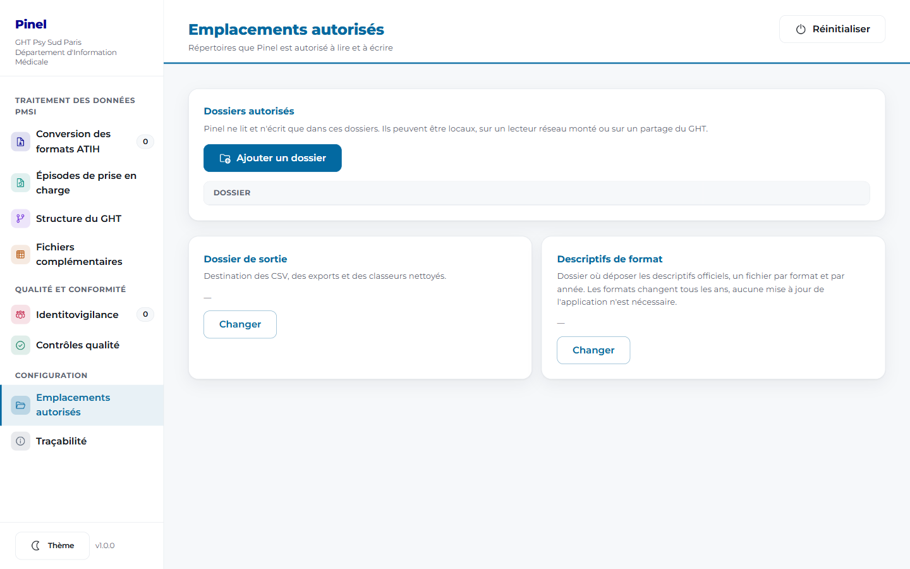
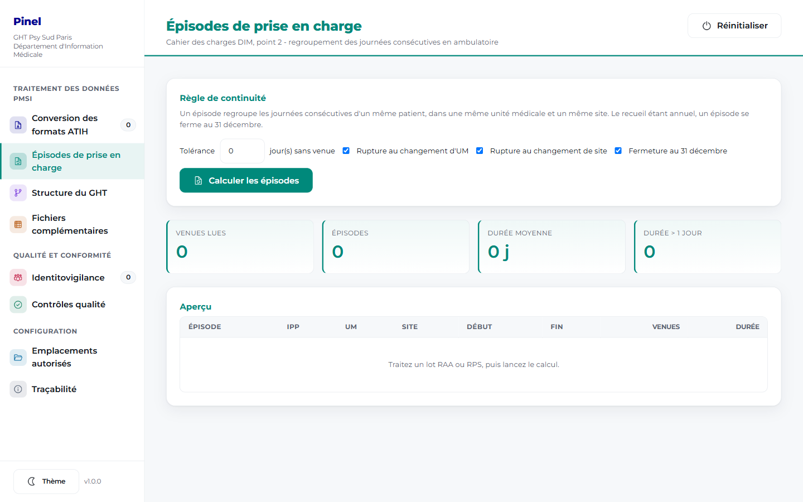
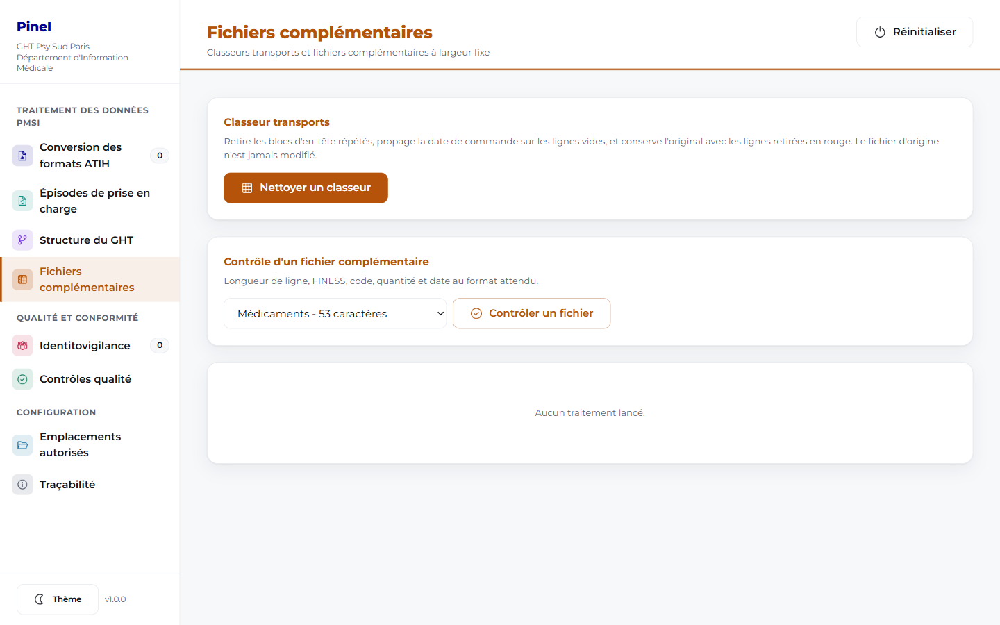

# Pinel - Guide utilisateur

Version 1.0.0. Destinataires : techniciens d'information médicale et médecins du
Département d'Information Médicale, GHT Psy Sud Paris.

---

## 1. Ce que fait Pinel

Les fichiers transmis aux tutelles sont des fichiers texte à largeur fixe. Tout y
est collé : l'identifiant du patient, la date de naissance, le numéro de séjour,
les codes. Ouvert dans Excel, un RPS donne une colonne unique de 154 caractères,
illisible.

Pinel découpe ces fichiers et les rend exploitables. Il répond au cahier des
charges du Département d'Information Médicale du 22 décembre 2025 et reprend la
moulinette Excel utilisée pour les fichiers complémentaires transports.

Le nom vient de Philippe Pinel, médecin qui a fait retirer les chaînes des
aliénés à Bicêtre en 1793 et fondé la psychiatrie moderne.

### 1.0 Une note sur les noms

Le nom de l'application, les intitulés des écrans, les noms des fichiers
produits et les libellés des colonnes des CSV ne sont pas définitifs. Ils ont
été choisis pour être compréhensibles par un technicien d'information médicale,
mais ils restent des propositions.

Le DIM et la direction des ressources numériques peuvent demander tout
changement de dénomination : il sera repris dans l'application et dans les
quatre documents du dossier. Les noms de colonnes des exports sont d'ailleurs
définis dans les descriptifs de format déposés par le DIM, donc modifiables
sans intervention sur l'application, voir le chapitre 4.3.

### 1.1 Les quatre demandes du cahier des charges

| Demande | État | Chapitre |
|---|---|---|
| Convertir les fichiers du format national en CSV exploitable, RPS et RAA en priorité | Traité | 4 |
| Créer des épisodes de prise en charge en ambulatoire psychiatrique | Traité | 5 |
| Mettre en forme le fichier de structure du GHT | Traité en partie | 6 |
| Pistes d'intelligence artificielle sur l'exhaustivité du recueil | Non traité, voir 9 | 9 |

### 1.2 Ce que Pinel ne fait pas

Il ne remplace ni CPage, ni DxCare, ni PMSI-Pilot, ni BIQuery, et ne se connecte
à aucun d'entre eux. Il lit des fichiers déjà extraits et il produit des
fichiers. Il ne transmet rien aux tutelles, le dépôt reste manuel.

---

## 2. Premier lancement

Un seul fichier, `Pinel.exe`, à copier dans un dossier de votre profil. Aucune
installation, aucun droit administrateur.

Le poste doit disposer du composant WebView2, présent d'origine sur Windows 11
et sur Windows 10 à jour. S'il manque, l'application s'ouvre sur une fenêtre
blanche : c'est à signaler à la direction des ressources numériques.


La colonne de gauche donne les huit écrans. Les quatre premiers correspondent au
traitement des données, les deux suivants à la qualité, les deux derniers à la
configuration du poste.

---

## 3. Déclarer vos emplacements de travail

Pinel ne lit et n'écrit que dans les répertoires que vous déclarez. C'est la
première chose à faire.



Ouvrez **Emplacements autorisés**, puis **Ajouter un dossier**. Vous pouvez
déclarer un dossier local, un lecteur réseau monté comme `O:\RIMP`, ou un
partage du GHT. Les emplacements sont conservés d'une session à l'autre.

La liste peut contenir des dossiers que vous n'avez pas ajoutés vous-même : la
direction des ressources numériques peut en imposer par stratégie de groupe.

Deux réglages complètent l'écran :

- le **dossier de sortie**, destination des CSV et des classeurs produits ;
- le **dossier des descriptifs de format**, expliqué au chapitre 4.3.

---

## 4. Convertir un lot de fichiers

Premier point du cahier des charges.

### 4.1 Les quatre étapes

1. Ouvrez **Conversion des formats ATIH** et cliquez sur **Ajouter un dossier**.
2. Cliquez sur **Scanner**. Pinel parcourt le dossier et ses sous-dossiers,
   retient les fichiers .txt et .csv, et affiche le format reconnu pour chacun.
3. Cliquez sur **Traiter**. La lecture démarre, plusieurs fichiers en parallèle.
4. Cliquez sur **Exporter en CSV**. Un fichier CSV par fichier source est écrit
   dans le dossier de sortie.

### 4.2 Ce que contient le CSV

Une ligne par ligne du fichier d'origine, une colonne par champ décrit, plus le
nom du fichier source et le numéro de ligne. Séparateur point-virgule, encodage
UTF-8 avec indicateur d'ordre des octets, donc ouverture directe dans Excel sans
assistant d'importation et sans accents cassés.

### 4.3 Les descriptifs de format, à déposer une fois par an

Le cahier des charges le souligne : les formats changent tous les ans. Pinel ne
fige donc aucune position de champ dans son code. Il lit des descriptifs que
vous déposez, recopiés des descriptifs officiels de l'ATIH.

Un descriptif est un fichier texte nommé `RPS.format.csv`, à placer dans le
dossier des descriptifs :

```
# format: RPS
# annee: 2025
nom;debut;longueur;libelle
FINESS;1;9;FINESS de l'etablissement
IPP;22;20;Identifiant permanent du patient
DATE_ACTE;42;8;Date de l'acte
```

Les positions se lisent comme dans les documents de l'ATIH, le premier caractère
de la ligne porte le numéro 1. Ajouter un millésime revient à déposer un
fichier : aucune nouvelle version de Pinel n'est nécessaire.

Tant qu'aucun descriptif n'est déposé pour un format, la conversion produit une
colonne contenant la ligne brute, et le signale. Pinel préfère un CSV honnête à
un découpage inventé.

### 4.4 Les formats reconnus

| Domaine | Formats |
|---|---|
| Psychiatrie | RPS, RAA, RPSA, R3A, FICHSUP-PSY, EDGAR, FICUM-PSY, RSF-ACE-PSY |
| SSR et SMR | RHS, SSRHA, RAPSS, FICHCOMP-SMR |
| HAD | RPSS, RAPSS-HAD, FICHCOMP-HAD, SSRHA-HAD |
| Transversal | VID-HOSP, ANO-HOSP, FICHCOMP |
| MCO | RSS, RSFA, RSFB, RSFC |

Le format VID-IPP, cité dans le cahier des charges, n'est pas encore reconnu par
son nom de fichier. Il le sera dès que son descriptif sera fourni.

---

## 5. Calculer les épisodes de prise en charge

Deuxième point du cahier des charges.



Dans le format national, l'activité ambulatoire n'est rattachée ni à un séjour
ni à un dossier. Pinel reconstitue une maille intermédiaire : l'épisode.

### 5.1 La règle

Un épisode regroupe les journées consécutives d'un même patient, dans une même
unité médicale et un même site. Il se ferme dès qu'une journée est sautée, et
dans tous les cas au 31 décembre, le recueil étant annuel.

Quatre réglages permettent d'ajuster, et la règle appliquée est écrite dans le
fichier produit :

- tolérance en jours sans venue, zéro par défaut ;
- rupture au changement d'unité médicale ;
- rupture au changement de site ;
- fermeture au 31 décembre.

### 5.2 Le résultat

Chaque épisode reçoit un identifiant stable, construit sur le patient, le site,
l'unité et la date de début : deux calculs sur le même lot donnent les mêmes
identifiants. Le CSV produit contient les dates de début et de fin, le nombre de
venues et la durée de présence.

La durée vaut 0 pour une venue isolée, 1 pour deux journées consécutives.
Au-delà, en secteur d'urgence, le compteur **Durée supérieure à 1 jour** signale
les situations que le DIM veut regarder : un problème d'aval ou d'organisation
dans le parcours.

### 5.3 Prérequis

Le calcul demande un descriptif de format déclarant au minimum un identifiant
patient et une date. Si le descriptif manque, Pinel liste les fichiers écartés
plutôt que de produire des épisodes faux.

---

## 6. Structure du GHT

Troisième point du cahier des charges. Ouvrez **Structure du GHT** et désignez
le fichier, en CSV ou en TSV. Pinel reconnaît les colonnes même si les intitulés
varient, reconstruit l'arbre des rattachements et repère les codes de secteur
ARS avec leur type : G pour adulte, I pour infanto-juvénile, D pour UMD, P pour
UHSA, Z pour intersectoriel.

La représentation graphique demandée pour le groupe FICOM n'est pas encore
produite automatiquement.

---

## 7. Fichiers complémentaires



**Nettoyage d'un classeur transports.** Les exports de la chaîne de facturation
répètent le bloc d'en-tête toutes les quelques lignes et laissent la date de
commande vide. Pinel produit une copie nettoyée : blocs répétés retirés, date
propagée sur les lignes vides, et une seconde feuille qui conserve l'original
avec les lignes retirées en rouge. Le fichier d'origine n'est jamais modifié.

**Contrôle d'un fichier complémentaire.** Longueur de ligne, FINESS, code,
quantité et date sont vérifiés : 53 caractères pour les médicaments, 50 pour les
dispositifs médicaux implantables. Les anomalies sont listées avec leur numéro
de ligne.

---

## 8. Identitovigilance et contrôles qualité

**Identitovigilance.** Quand un même identifiant patient porte deux dates de
naissance selon les fichiers, le chaînage casse et le patient est compté deux
fois. L'écran liste les conflits avec les dates observées, leur nombre
d'occurrences et les fichiers d'origine. La date la plus fréquente est proposée,
vous pouvez en choisir une autre. Un arbitrage automatique reste une hypothèse :
sur un patient suivi de longue date, vérifiez dans DxCare avant de trancher.

Vos arbitrages vivent en mémoire de la session. Ils ne sont écrits sur disque
qu'au moment où vous exportez, en CSV ou en fichier assaini. Une
réinitialisation ou une fermeture de l'application les perd.

**Contrôles qualité.** Six contrôles fichier par fichier : FINESS, format de
date de naissance, identifiant en clair resté dans un fichier anonymisé, NIR de
chaînage, lignes strictement identiques, cohérence entre l'année du nom de
fichier et les données. Un septième contrôle croise les fichiers entre eux : il
vérifie que chaque identifiant patient présent dans l'activité est bien chaîné
dans le VID-HOSP, et signale les identifiants orphelins.

Chaque anomalie porte un niveau de gravité, du plus grave au plus anodin :
Blocker, Error, Warning, Info. Un Blocker signifie qu'il ne faut pas transmettre
en l'état. C'est ce niveau qui pilote le code de sortie du mode automatique.

---

## 9. Ce qui reste à faire

Le quatrième point du cahier des charges, fiabiliser l'exhaustivité du recueil
ambulatoire à partir des signaux d'activité de DxCare et DxPlanning, n'est pas
développé. Il suppose un accès en lecture au système d'information, donc une
instruction préalable par la direction des ressources numériques. La notion
d'épisode livrée au chapitre 5 en constitue le socle.

Restent également l'export dédié vers PMSI-Pilot, la représentation graphique de
la structure, et le format VID-IPP.

---

## 10. Bonnes pratiques

Les fichiers manipulés contiennent des données de santé nominatives. Les règles
habituelles du DIM s'appliquent sans exception : pas de copie sur une clé USB,
pas d'envoi par messagerie personnelle, pas de dépôt sur un service en ligne.

Utilisez **Réinitialiser** entre deux sessions de travail, en particulier sur un
poste partagé : les données lues ne vivent qu'en mémoire et disparaissent.

L'écran **Traçabilité** indique où se trouve le journal d'audit et affiche le
journal de la session en cours.

Un mode en ligne de commande existe pour les traitements planifiés, il est
décrit dans le dossier technique destiné à la direction des ressources
numériques. Si vous rencontrez un raccourci qui lance Pinel sans ouvrir de
fenêtre, c'est de cela qu'il s'agit.

---

## 11. Problèmes courants

| Symptôme | Cause probable | Solution |
|---|---|---|
| Un fichier apparaît en INCONNU | Le nom ne permet pas d'identifier le format | Renommer selon la convention ATIH, en faisant apparaître le format et l'année |
| Le dossier est refusé | Emplacement non déclaré | Ajouter le dossier dans Emplacements autorisés |
| Le CSV contient une seule colonne de texte | Aucun descriptif déposé pour ce format | Déposer le descriptif officiel, voir 4.3 |
| Aucun épisode calculé | Le descriptif ne déclare ni identifiant ni date | Compléter le descriptif du format concerné |
| La fenêtre reste blanche | WebView2 absent ou en cours de mise à jour | Signaler à la direction des ressources numériques |

---

## 12. Contact

Adam BELOUCIF
Apprenti ingénieur PMSI, Département d'Information Médicale
Téléphone 01 42 11 70 60, courriel adam.beloucif@psysudparis.fr

GH Fondation Vallée - Paul Guiraud, GHT Psy Sud Paris
54, avenue de la République, BP 20065, 94806 Villejuif cedex
